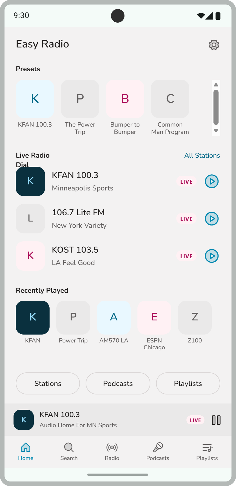
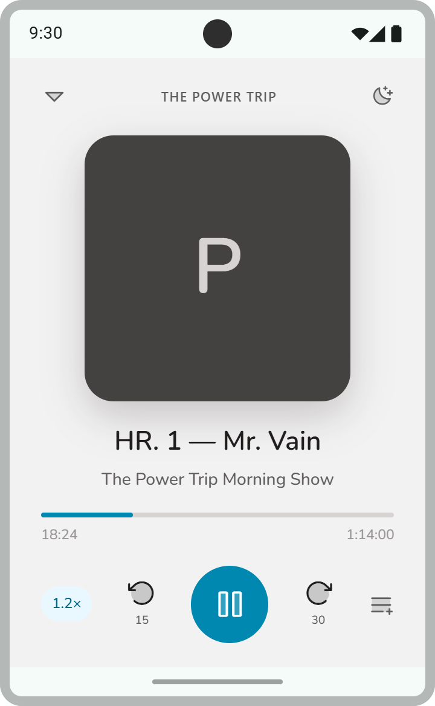
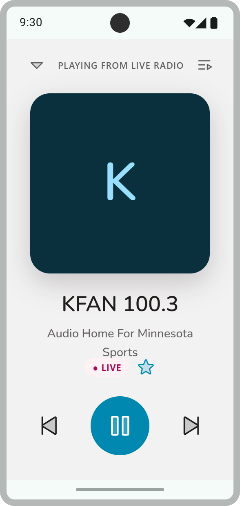

# Easy Radio

A native Android app that combines live internet radio with a full podcast player — one home screen for both, with first-class support for **Android Auto** and a companion **Wear OS** app.

<p align="center">
  
  
  
</p>

## Features

**Radio**
- Browse and search live stations (via [Radio-Browser](https://www.radio-browser.info/)), filter by city/genre
- Curated presets, one-tap favoriting
- Home-screen genre discovery based on interests picked during onboarding

**Podcasts**
- Search and subscribe (via Apple's iTunes Search API), paginated episode lists for shows with large back-catalogs
- Resume-where-you-left-off, adjustable playback speed, draggable seek bar
- Downloads for offline listening, an "Up Next" queue, playlists
- **OPML import/export** to migrate subscriptions to/from other podcast apps
- **Podcasting 2.0 chapters** — tappable chapter markers on the seek bar, when a feed publishes them
- **Transcript view** — full-screen scrollable transcript, when a feed publishes one
- **New-episode notifications** and optional **auto-download**, checked periodically in the background
- **Sleep timer**, configurable skip-back/skip-forward intervals, **trim silence** and **voice boost** playback options

**Everywhere**
- **Android Auto / Automotive OS**: a full browse tree (Radio → stations, Podcasts → episodes) and playback controls, no phone screen required
- **Wear OS companion app**: control playback from the wrist
- A home-screen widget showing what's playing with play/pause and skip-forward
- Per-day **listening stats** (today / this week)
- Light/dark/system theme

See [`docs/future-enhancements.md`](docs/future-enhancements.md) for ideas that were scoped out (e.g. switching podcast search to a more typo-tolerant backend, cloud sync across devices).

## Tech stack

| Layer | Choice |
|---|---|
| Language | Kotlin |
| UI | Jetpack Compose (Compose for Wear OS on the watch) |
| Playback | Media3 (ExoPlayer + `MediaLibraryService`) — one playback/session implementation shared by the phone UI, notification, Android Auto, and Wear OS |
| Local storage | Room |
| Async | Kotlin Coroutines + Flow |
| Networking | Retrofit + OkHttp + kotlinx.serialization (Radio-Browser, iTunes Search), a hand-rolled SAX parser for podcast RSS/OPML/chapters/transcripts |
| Background work | WorkManager (periodic new-episode checks) |
| Home-screen widget | Glance |
| Dependency wiring | A small manual DI object (`EasyRadioGraph`) rather than a DI framework |

## Project structure

Multi-module Gradle project:

```
app/            Phone UI, playback service, Android Auto browse tree, widget
wear/           Wear OS companion app
core/model/     Plain Kotlin data models shared across modules
core/network/   Retrofit/OkHttp API clients, RSS/OPML/chapters/transcript parsing
core/database/  Room entities/DAOs and repositories
core/media/     Playback-adjacent pure logic (sleep timer, browse tree, state mapping)
docs/           Design references, tech-stack notes, future-enhancements log
```

## Building

```
./gradlew :app:assembleDebug
```

Requires a `local.properties` with your Android SDK location (standard Android Studio setup). No API keys are needed — Radio-Browser and the iTunes Search API are both key-less.

## Testing

```
./gradlew :core:model:test :core:network:test :core:database:testDebugUnitTest :app:testDebugUnitTest
```

## License

Mozilla Public License 2.0 — see [`LICENSE`](LICENSE).
